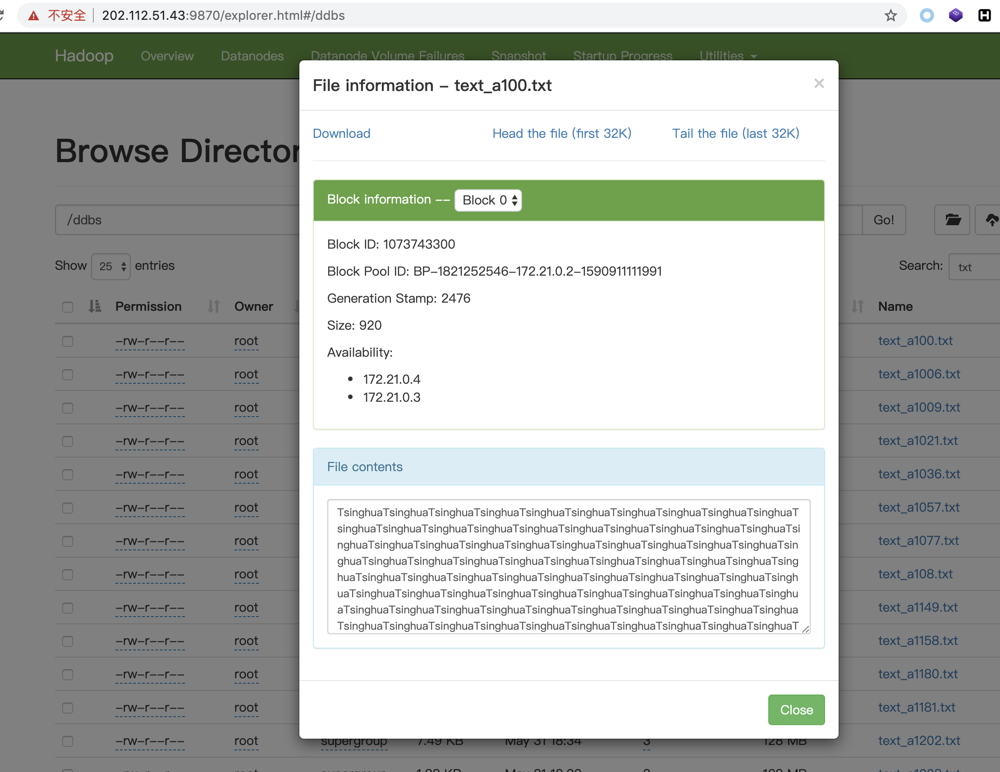

# 分布式数据库系统课程大作业

**总体架构**

MongoDB集群存user、read、be_read、article、popular_rank五个collection。

Hadoop-HDFS集群存articles对应的img、txt、flv等文件。

**MongoDB集群架构**

- Shard:

  用于存储实际的数据块，一个shard server角色由3台机器组个一个replica set承担，防止主机单点故障

- Config Server:

  mongod实例，存储了整个 ClusterMetadata，其中包括 chunk信息。

- Query Routers:

  前端路由，客户端由此接入，且让整个集群看上去像单一数据库，前端应用可以透明使用。


共用10个节点：分片集群，1个Router-mongos，3个Config Server，2个Shard Server（replica set）每个都是1主节点2个附节点

使用了docker-compose技术，一键启动MongoDB集群

**docker-compose.yml**

```yml
version: '3'
services:
  # 分片集群，1个Router-mongos，3个Config Server，2个Shard Server（replica set）每个都是1主节点2个附节点
  configsvr0:
    container_name: configsvr0
    image: mongo
    networks:
      mongo:
        ipv4_address: 172.22.0.2
    volumes:
      - ./configsvr0/data/db:/data/db
      - ./configsvr0/data/configdb:/data/configdb
    command: --configsvr --replSet "rs_configsvr" --bind_ip_all
    restart: always
  configsvr1:
    container_name: configsvr1
    image: mongo
    networks:
      mongo:
        ipv4_address: 172.22.0.3
    volumes:
      - ./configsvr1/data/db:/data/db
      - ./configsvr1/data/configdb:/data/configdb
    command: --configsvr --replSet "rs_configsvr" --bind_ip_all
    restart: always
  configsvr2:
    container_name: configsvr2
    image: mongo
    networks:
      mongo:
        ipv4_address: 172.22.0.4
    volumes:
      - ./configsvr2/data/db:/data/db
      - ./configsvr2/data/configdb:/data/configdb
    command: --configsvr --replSet "rs_configsvr" --bind_ip_all
    restart: always
  shardsvr00:
    container_name: shardsvr00
    networks:
      mongo:
        ipv4_address: 172.22.0.5
    image: mongo
    volumes:
      - ./shardsvr00/data/db:/data/db
      - ./shardsvr00/data/configdb:/data/configdb
    command: --shardsvr --replSet "rs_shardsvr0" --bind_ip_all
    restart: always
    depends_on:
      - configsvr0
      - configsvr1
      - configsvr2
  shardsvr01:
    container_name: shardsvr01
    networks:
      mongo:
        ipv4_address: 172.22.0.6
    image: mongo
    volumes:
      - ./shardsvr01/data/db:/data/db
      - ./shardsvr01/data/configdb:/data/configdb
    command: --shardsvr --replSet "rs_shardsvr0" --bind_ip_all
    restart: always
    depends_on:
      - configsvr0
      - configsvr1
      - configsvr2
  shardsvr02:
    container_name: shardsvr02
    networks:
      mongo:
        ipv4_address: 172.22.0.7
    image: mongo
    volumes:
      - ./shardsvr02/data/db:/data/db
      - ./shardsvr02/data/configdb:/data/configdb
    command: --shardsvr --replSet "rs_shardsvr0" --bind_ip_all
    restart: always
    depends_on:
      - configsvr0
      - configsvr1
      - configsvr2
  shardsvr10:
    container_name: shardsvr10
    networks:
      mongo:
        ipv4_address: 172.22.0.9
    image: mongo
    volumes:
      - ./shardsvr10/data/db:/data/db
      - ./shardsvr10/data/configdb:/data/configdb
    command: --shardsvr --replSet "rs_shardsvr1" --bind_ip_all
    restart: always
    depends_on:
      - configsvr0
      - configsvr1
      - configsvr2
  shardsvr11:
    container_name: shardsvr11
    networks:
      mongo:
        ipv4_address: 172.22.0.10
    image: mongo
    volumes:
      - ./shardsvr11/data/db:/data/db
      - ./shardsvr11/data/configdb:/data/configdb
    command: --shardsvr --replSet "rs_shardsvr1" --bind_ip_all
    restart: always
    depends_on:
      - configsvr0
      - configsvr1
      - configsvr2
  shardsvr12:
    container_name: shardsvr12
    networks:
      mongo:
        ipv4_address: 172.22.0.11
    image: mongo
    volumes:
      - ./shardsvr12/data/db:/data/db
      - ./shardsvr12/data/configdb:/data/configdb
    command: --shardsvr --replSet "rs_shardsvr1" --bind_ip_all
    restart: always
    depends_on:
      - configsvr0
      - configsvr1
      - configsvr2
  mongos:
    container_name: mongos
    networks:
      mongo:
        ipv4_address: 172.22.0.8
    image: mongo
    volumes:
      - ./mongos/data/db:/data/db
      - ./mongos/data/configdb:/data/configdb
    entrypoint: mongos
    command: --configdb rs_configsvr/172.22.0.2:27019,172.22.0.3:27019,172.22.0.4:27019 --bind_ip_all
    depends_on:
      - shardsvr00
      - shardsvr01
      - shardsvr02
      - shardsvr10
      - shardsvr11
      - shardsvr12

networks:
  mongo:
    driver: bridge
    ipam:
      config:
        - subnet: 172.22.0.1/24
```

节点启动成功，并映射出各个容器内的存储文件


依次执行下述命令，完成mongo集群的搭建，以及存储数据库的分片。

```bash
#configsvr0
#创建配置服务复制集
mongo --host 172.22.0.2 --port 27019
rs.initiate(
  {
    _id: "rs_configsvr",
    configsvr: true,
    members: [
      { _id : 0, host : "172.22.0.2:27019" },
      { _id : 1, host : "172.22.0.3:27019" },
      { _id : 2, host : "172.22.0.4:27019" }
    ]
  }
)
exit

#shardsvr00
#创建分片复制集
mongo --host 172.22.0.5 --port 27018
rs.initiate(
  {
    _id : "rs_shardsvr0",
    members: [
      { _id : 0, host : "172.22.0.5:27018" },
      { _id : 1, host : "172.22.0.6:27018" },
      { _id : 2, host : "172.22.0.7:27018" }
    ]
  }
)
exit
#shardsvr10
mongo --host 172.22.0.9 --port 27018
rs.initiate(
  {
    _id : "rs_shardsvr1",
    members: [
      { _id : 0, host : "172.22.0.9:27018" },
      { _id : 1, host : "172.22.0.10:27018" },
      { _id : 2, host : "172.22.0.11:27018" }
    ]
  }
)
exit

#mongos
#增加shardsvr到集群
mongo --host 172.22.0.8 --port 27017
sh.addShard("rs_shardsvr0/172.22.0.5:27018,172.22.0.6:27018,172.22.0.7:27018")
sh.addShard("rs_shardsvr1/172.22.0.9:27018,172.22.0.10:27018,172.22.0.11:27018")
#数据库启用分片
sh.enableSharding("ddbs")


#对user表进行分片
sh.addShardTag("rs_shardsvr0", "bj")
sh.addShardTag("rs_shardsvr1", "hk")
use ddbs
db.createCollection('user')
sh.shardCollection("ddbs.user", { "region": 1 ,"uid":1})

sh.addTagRange("ddbs.user", { region: "Beijing" ,"uid" : MinKey},{ region: "Beijing","uid" : MaxKey }, "bj")
sh.addTagRange("ddbs.user", { region: "Hong Kong" ,"uid" : MinKey},{ region: "Hong Kong","uid" : MaxKey }, "hk") 
#向mongos导入user.dat
mongoimport --host 172.22.0.8 --port 27017 -d ddbs -c user --file user.dat


#对article表进行分片
sh.addShardTag("rs_shardsvr0", "dbms1")
sh.addShardTag("rs_shardsvr1", "dbms2")
use ddbs
db.createCollection('article')
sh.addTagRange("ddbs.article", { category: "science" ,"aid" : MinKey},{ category: "science","aid" : MaxKey }, "dbms1")
sh.addTagRange("ddbs.article", { category: "technology" ,"aid" : MinKey},{ category: "technology","aid" : MaxKey }, "dbms2") 
sh.shardCollection("ddbs.article", { "category": 1 ,"aid":1})
#向mongos导入article.dat
mongoimport --host 172.22.0.8 --port 27017 -d ddbs -c article --file article.dat

#向mongos导入read.dat
mongoimport --host 172.22.0.8 --port 27017 -d ddbs -c read --file read.dat

```

**数据生成**

运行数据生成脚本，这里改正一个bug，gen_an_article函数里面，image_num和num_image应为同一个值

**genTable_mongoDB_10G.py**

```python
import json
from random import random
import numpy as np
from PIL import Image
from shutil import copyfile
import os
from tqdm import tqdm

USERS_NUM = 10000
ARTICLES_NUM = 200000
READS_NUM = 1000000

uid_region = {}
aid_lang = {}


# Beijing:60%   Hong Kong:40%
# en:20%    zh:80%
# 20 depts
# 3 roles
# 50 tags
# 0~99 credits

def gen_an_user (i):
    timeBegin = 1506328859000
    user = {}
    user["timestamp"] = str(timeBegin + i)
    user["id"] = 'u'+str(i)
    user["uid"] = str(i)
    user["name"] = "user%d" % i
    user["gender"] = "male" if random() > 0.33 else "female"
    user["email"] = "email%d" % i
    user["phone"] = "phone%d" % i
    user["dept"]  = "dept%d" % int(random() * 20)
    user["grade"] = "grade%d" % int(random() * 4 + 1)
    user["language"] = "en" if random() > 0.8 else "zh"
    user["region"] = "Beijing" if random() > 0.4 else "Hong Kong"
    user["role"] = "role%d" % int(random() * 3)
    user["preferTags"] = "tags%d" % int(random() * 50)
    user["obtainedCredits"] = str(int(random() * 100))

    uid_region[user["uid"]] = user["region"]
    return user

# science:45%   technology:55%
# en:50%    zh:50%
# 50 tags
# 2000 authors
def gen_an_article (i):
    timeBegin = 1506000000000
    article = {}
    article["id"] = 'a'+str(i)
    article["timestamp"] = str(timeBegin + i)
    article["aid"] = str(i)
    article["title"] = "title%d" % i
    article["category"] = "science" if random() > 0.55 else "technology"
    article["abstract"] = "abstract of article %d" % i
    article["articleTags"] = "tags%d" % int(random() * 50)
    article["authors"]  = "author%d" % int(random() * 2000)
    article["language"] = "en" if random() > 0.5 else "zh" 

    # create text
    article["text"] = "text_a"+str(i)+'.txt'
    path = './articles/article'+str(i)
    if not os.path.exists(path):
        os.makedirs(path) 
    num = int(random()*1000)
    text = ['Tsinghua']*num
    f = open(path+"/text_a"+str(i)+'.txt','w+',encoding="utf8")
    f.write("".join(text))
    f.close()

    # create images
    image_num = int(random()*5)+1
    image_str = ""
    for j in range(image_num):
        image_str+= 'image_a'+str(i)+'_'+str(j)+'.jpg,'
    article["image"] = image_str
    # num_image = int(random()*5)+1
    num_image = image_num
    for j in range(num_image):
        a = np.random.randint(0,255,(360,480,3))
        img = Image.fromarray(a.astype('uint8')).convert('RGB')
        img.save(path+'/image_a'+str(i)+'_'+str(j)+'.jpg')

    # create video
    if random() < 0.05:
        #has one video
        article["video"] = "video_a"+str(i)+'_video.flv'
        if random()<0.5:
            copyfile('./video/video1.flv',path+"/video_a"+str(i)+'_video.flv')
        else:
            copyfile('./video/video2.flv',path+"/video_a"+str(i)+'_video.flv')
    else:
        article["video"] = ""

    aid_lang[article["aid"]] = article["language"]
    return article

# user in Beijing read/agree/comment/share an english article with the probability 0.6/0.2/0.2/0.1
# user in Hong Kong read/agree/comment/share an Chinese article with the probability 0.8/0.2/0.2/0.1
p = {}
p["Beijing"+"en"] = [0.6,0.2,0.2,0.1]
p["Beijing"+"zh"] = [1,0.3,0.3,0.2]
p["Hong Kong"+"en"] = [1,0.3,0.3,0.2]
p["Hong Kong"+"zh"] = [0.8,0.2,0.2,0.1]
def gen_an_read (i):
    timeBegin = 1506332297000
    read = {}
    read["timestamp"] = str(timeBegin + i*10000)
    read["id"] = 'r'+str(i)
    read["uid"] = str(int(random() * USERS_NUM))
    read["aid"] = str(int(random() * ARTICLES_NUM))
    
    region = uid_region[read["uid"]]
    lang = aid_lang[read["aid"]]
    ps = p[region + lang]

    if (random() > ps[0]):
        # read["readOrNot"] = "0";
        return gen_an_read (i)
    else:
        read["readOrNot"] = "1"
        read["readTimeLength"] = str(int(random() * 100))
        read["readSequence"] = str(int(random() * 4))
        read["agreeOrNot"] = "1" if random() < ps[1] else "0"
        read["commentOrNot"] = "1" if random() < ps[2] else "0"
        read["shareOrNot"] = "1" if random() < ps[3] else "0"
        read["commentDetail"] = "comments to this article: (" + read["uid"] + "," + read["aid"] + ")" 
    return read

with open("user.dat", "w+") as f:
    for i in range (USERS_NUM):
        json.dump(gen_an_user(i), f)
        f.write("\n")

if not os.path.exists('./articles'):
    os.makedirs('./articles')
with open("article.dat", "w+") as f:
    for i in tqdm(range(ARTICLES_NUM)):
        json.dump(gen_an_article(i), f)
        f.write("\n")


with open("read.dat", "w+") as f:
    for i in range(READS_NUM):
        json.dump(gen_an_read(i), f)
        f.write("\n")
```

**通过聚合和管道生成be_read collection**

```yml
db.read.aggregate( [
   {
     $group: {
        _id: "$aid",
        timestamp: { $max: {$toLong:"$timestamp"} },
        readNum: { $sum: {$cond: [{"$eq":["$readOrNot", "1"]}, 1, 0] } },
        readUidList: { $push: { $cond: [{"$eq":["$readOrNot", "1"]}, "$uid", "$$REMOVE"] } },
        commentNum: { $sum: {$cond: [{"$eq":["$commentOrNot", "1"]}, 1, 0] } },
        commentUidList: { $push: { $cond: [{"$eq":["$commentOrNot", "1"]}, "$uid", "$$REMOVE"] } },
        agreeNum: { $sum: {$cond: [{"$eq":["$agreeOrNot", "1"]}, 1, 0] } },
        agreeUidList: { $push: { $cond: [{"$eq":["$agreeOrNot", "1"]}, "$uid", "$$REMOVE"] } },
        shareNum: { $sum: {$cond: [{"$eq":["$shareOrNot", "1"]}, 1, 0] } },
        shareUidList: { $push: { $cond: [{"$eq":["$shareOrNot", "1"]}, "$uid", "$$REMOVE"] } }
     }
   },
   { $project: {_id:0, aid:"$_id", timestamp:1, readNum:1, readUidList:1, commentNum:1, commentUidList:1, agreeNum:1, agreeUidList:1, shareNum:1, shareUidList:1} },
   { $out : "be_read" }
] )
```

**通过聚合和管道生成popular_rank collection**

```yml
Popular_Rank = function(startDate) {
    db.read.aggregate( [
      { $project: { timestamp: { $toDate : {$toLong:"$timestamp"} } ,readOrNot:1, aid:1} }, 
      { $match: { $and: [ {timestamp: { $gte: startDate }},{readOrNot: {$eq: "1"}}] } },
      { $group: { 
          _id: { 
             aid: "$aid",
             yearmonth: {$dateToString: { format: "%Y-%m", date: "$timestamp" }}
          }, 
          readNum: { $sum: 1}
      } },
      { $sort : {readNum:-1} },
      { $group: { 
          _id: "$_id.yearmonth",
          articleAidList: { $push: "$_id.aid" }
      } },
      { $project : {_id:{$concat:[{$toString:{ $toDate: "$_id" }}, "monthly"]}, timestamp:{$toDate:"$_id"}, articleAidList:{$slice:["$articleAidList", 5]}, temporalGranularity:"monthly"}},
      { $merge: { into: "popular_rank", whenMatched: "replace" } }
   ] );
   db.read.aggregate( [
      { $project: { timestamp: { $toDate : {$toLong:"$timestamp"} } ,readOrNot:1, aid:1} }, 
      { $match: { $and: [ {timestamp: { $gte: startDate }},{readOrNot: {$eq: "1"}}] } },
      { $group: { 
          _id: { 
             aid: "$aid",
             weeks:{ $subtract:[{$toLong:"$timestamp"} , {$mod: [ {$toLong:"$timestamp"}, 604800000 ] }]}
          }, 
          readNum: { $sum: 1}
      } },
      { $sort : {readNum:-1} },
      { $group: { 
          _id: "$_id.weeks",
          articleAidList: { $push: "$_id.aid" }
      } },
      { $project : {_id:{$concat:[{$toString:{ $toDate: "$_id" }}, "weekly"]}, timestamp:{ $toDate: "$_id" }, articleAidList:{$slice:["$articleAidList", 5]}, temporalGranularity:"weekly"}},
      { $merge: { into: "popular_rank", whenMatched: "replace" } }
   ] );
   db.read.aggregate( [
      { $project: { timestamp: { $toDate : {$toLong:"$timestamp"} } ,readOrNot:1, aid:1} }, 
      { $match: { $and: [ {timestamp: { $gte: startDate }},{readOrNot: {$eq: "1"}}] } },
      { $group: { 
          _id: { 
             aid: "$aid",
             days:{ $subtract:[{$toLong:"$timestamp"} , {$mod: [ {$toLong:"$timestamp"}, 86400000 ] }]}
          }, 
          readNum: { $sum: 1}
      } },
      { $sort : {readNum:-1} },
      { $group: { 
          _id: "$_id.days",
          articleAidList: { $push: "$_id.aid" }
      } },
      { $project : {_id:{$concat:[{$toString:{ $toDate: "$_id" }}, "daily"]}, timestamp:{ $toDate: "$_id" }, articleAidList:{$slice:["$articleAidList", 5]}, temporalGranularity:"daily"}},
      { $merge: { into: "popular_rank", whenMatched: "replace" } }
   ],{ allowDiskUse: true } );
};
Popular_Rank(new ISODate("1970-01-01"))
```

**mongo-express**

运行mongo-express可以作为数据查询展示

```bash
docker run -it --rm -p 8081:8081 --link mongos:mongo --net mongodb_mongo mongo-express
```


**Hadoop-HDFS**

一个namenode两个datenode

**docker-compose.yml**

```yml
version: "3"

services:
  namenode:
    image: bde2020/hadoop-namenode:2.0.0-hadoop3.2.1-java8
    container_name: namenode
    restart: always
    ports:
      - 9870:9870
      - 9000:9000
    volumes:
      - hadoop_namenode:/hadoop/dfs/name
    environment:
      - CLUSTER_NAME=test
    env_file:
      - ./hadoop.env
    networks:
      hadoopnet:
        ipv4_address: 172.21.0.2

  datanode1:
    image: bde2020/hadoop-datanode:2.0.0-hadoop3.2.1-java8
    container_name: datanode1
    restart: always
    hostname: 172.21.0.3
    volumes:
      - hadoop_datanode1:/hadoop/dfs/data
    environment:
      SERVICE_PRECONDITION: "namenode:9870"
    env_file:
      - ./hadoop.env
    networks:
      hadoopnet:
        ipv4_address: 172.21.0.3

  datanode2:
    image: bde2020/hadoop-datanode:2.0.0-hadoop3.2.1-java8
    container_name: datanode2
    restart: always
    hostname: 172.21.0.4
    volumes:
      - hadoop_datanode2:/hadoop/dfs/data
    environment:
      SERVICE_PRECONDITION: "namenode:9870"
    env_file:
      - ./hadoop.env
    networks:
      hadoopnet:
        ipv4_address: 172.21.0.4

  resourcemanager:
    image: bde2020/hadoop-resourcemanager:2.0.0-hadoop3.2.1-java8
    container_name: resourcemanager
    restart: always
    environment:
      SERVICE_PRECONDITION: "namenode:9000 namenode:9870 datanode:9864"
    env_file:
      - ./hadoop.env
    networks:
      hadoopnet:
        ipv4_address: 172.21.0.5

  nodemanager1:
    image: bde2020/hadoop-nodemanager:2.0.0-hadoop3.2.1-java8
    container_name: nodemanager
    restart: always
    environment:
      SERVICE_PRECONDITION: "namenode:9000 namenode:9870 datanode:9864 resourcemanager:8088"
    env_file:
      - ./hadoop.env
    networks:
      hadoopnet:
        ipv4_address: 172.21.0.6

  historyserver:
    image: bde2020/hadoop-historyserver:2.0.0-hadoop3.2.1-java8
    container_name: historyserver
    restart: always
    environment:
      SERVICE_PRECONDITION: "namenode:9000 namenode:9870 datanode:9864 resourcemanager:8088"
    volumes:
      - hadoop_historyserver:/hadoop/yarn/timeline
    env_file:
      - ./hadoop.env
    networks:
      hadoopnet:
        ipv4_address: 172.21.0.7

volumes:
  hadoop_namenode:
  hadoop_datanode1:
  hadoop_datanode2:
  hadoop_historyserver:

networks:
  hadoopnet:
    driver: bridge
    ipam:
      driver: default
      config:
      -
        subnet: 172.21.0.0/24
```


在hadoop节点启动后，将txt、img、flv文件导入到HDFS中

**Insert2hdfs.py**

```python
#!/usr/bin/env python3
from tqdm import tqdm
from hdfs import *
import os

class pyhdfs(object):
    """docstring for pyhdfs"""
    def __init__(self, ip,port):
        self.ip = ip
        self.port = port
        self.url = 'http://'+self.ip+':'+self.port
        self.client = Client(self.url)
    def mkdir(self,dirname,permission=''):
        if permission:
            permission = int(permission)
        else:
            permission = 644
        self.client.makedirs(dirname,permission = permission)
    def rmdir(self,dirname):
        self.client.delete(dirname,True)
    def upload(self,dirname,filename):
        self.client.upload(dirname,filename)
    def download(self,filename,download_filename):
        self.client.download(filename,download_filename)
    def cat(self,filename):
        with self.client.read(filename) as f:
            return f.read()

class file_file(object):
    """docstring for file_file"""
    def __init__(self, work_dir):
        self.work_dir=work_dir
        self.all_files = []
    def get_all_files(self):
        for parent, dirnames, filenames in os.walk(self.work_dir):
            for filename in filenames:
                file_path = os.path.join(parent, filename)
                self.all_files.append(file_path)
        return self.all_files

if __name__ == '__main__':
    a = pyhdfs('127.0.0.1','9870')
    a.mkdir('/ddbs')
    files = file_file('articles')
    all_files = files.get_all_files()
    for file in tqdm(all_files):
        a.upload('/ddbs',file)
```

可以通过hdfs-web下载文件




**情况模拟**

1.备份

无论是热备份还是冷备份，只需保存数据库映射出的数据库文件


2.新增DBMS服务器

修改docker-compose.yml配置文件新增节点即可

```yml
  shardsvr_new:
    container_name: shardsvrnew
    networks:
      mongo:
        ipv4_address: x.x.x.x
    image: mongo
    volumes:
      - ./shardsvr11/data/db:/data/db
      - ./shardsvr11/data/configdb:/data/configdb
    command: --shardsvr --replSet "rs_shardsvr_new" --bind_ip_all
    restart: always
    depends_on:
      - configsvr0
      - configsvr1
      - configsvr2
```

3.DBMS节点宕机

如图：使shardsvr人工宕机


备份节点立刻接管主节点，用户无感知。


4.数据迁移

复制对应的数据，然后重新配置下网络拓扑关系